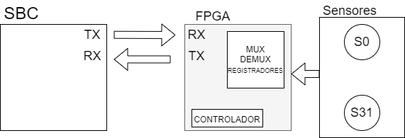
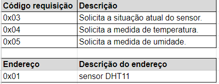
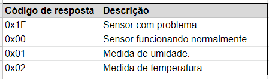
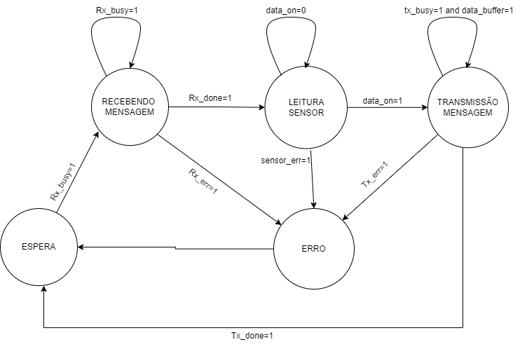
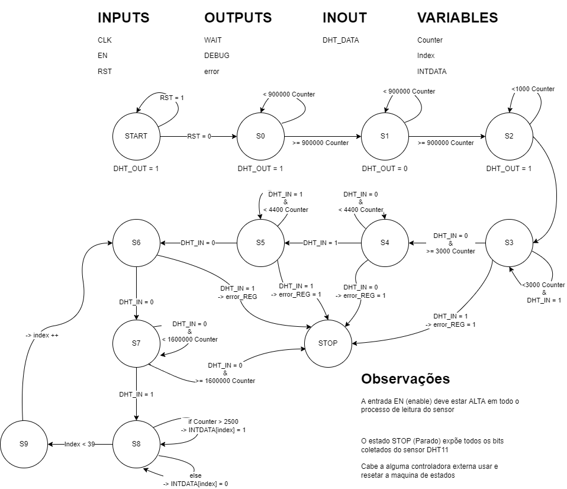

# Sistemas_digitais-Comunicacao-serial 
 Repositorio do problema 2 do MI sistemas digitais
 
<h1>Apresentação do sistema</h1>
O sistema proposto realiza a implementação de um protocolo de comunicação entre a Raspberry e a FPGA. 

O sistema realiza a medição de temperatura e umidade através do sensor DHT11, no qual o SBC envia requisições sobre qual informação deseja receber do sensor: situação, medida de temperatura e medida de umidade. Essa requisição é interpretada pelo sistema embarcado em FPGA, que realiza a obtenção dos dados e os envia como resposta para o SBC.

O sistema é modular, então aceita outros tipos de sensores, mas é necessário criar uma interface para o sensor que se deseja inserir. Essa interface deve respeitar as seguintes condições: receber requisições com comando de 8 bits e ser capaz de apresentar saídas agrupadas em bytes.
 
Foram utilizados para o desenvolvimento do sistema a linguagem de programação C, Verilog, Quartus Prime 21.1, o sensor DHT11, Raspberry PI 0 e Kit de desenvolvimento Mercury IV com o chip FPGA Cyclone IV 30K EP4CE30F23.

<h1>Diagrama de blocos</h1>
A imagem a seguir descreve em alto nível uma visão dos componentes do sistema desenvolvido.

<h1>Single Board Computer (SBC)</h1>
Para a implementação do SBC, foi necessário realizar a configuração da UART. Utilizou-se as bibliotecas <strong>unistd, fcntl e termios</strong>, seguindo os passos:
<ul>
<li>Mapeamento da memória da uart: utiliza a função open(“/dev/serial0”, tipos de abertura). Os tipos de abertura foram <i>O_RDWR, O_NOCTTY, O_NDELAY</i>, que abre no modo de leitura/gravação sem bloqueio;</li>
<li>E a configuração das flags, como valor de baud-rate, habilitação de paridade, tipo de paridade;</li>
 </ul>
 
Com a configuração da uart, foi possível realizar as demais configurações do SBC.

O SBC solicita ao usuário que selecione o sensor que deseja receber os dados e em seguida, o tipo de informação. Nesse caso, o sensor é o DHT11 e as informações podem ser a situação do sensor, medida de temperatura e umidade. A opções aparecem em forma de menu no terminal e o usuário deve digitar o número correspondente.
De acordo com as opções selecionadas, a requisição é enviada pela UART da Raspberry para a UART da FPGA. A requisição é composta por 2 bytes, 1 byte que indica o código da requisição e 1 byte que indica o endereço do sensor. A imagem abaixo indica o formato das requisições.

O envio de dados pela UART é feito utilizando a função write, no qual deve se indica o endereço do arquivo de mapeamento, o dado a ser enviado, e o tamanho do dado:
	<strong>write(enderecoArquivo,dado,tamanhoDado);</strong>

Para a leitura de dados enviados pela FPGA, a função read foi utilizada, que tem como parâmetros o endereço do arquivo da uart, o buffer para armazenar o dado a ser lido e o número máximo de bits a serem lidos. A função retorna o tamanho de bits lidos. 
 <strong>read(enderecoArquivo,buffer,tamanhoMaximo);</strong>
 
As respostas recebidas podem ser compostas por 1 byte ou 3 bytes. As respostas relacionadas à situação do sensor possuem 1 byte que é composto pelo código de resposta. As respostas sobre a medição de temperatura ou/e umidade possuem 1 byte que indica o código de resposta, 1 byte da parte inteira e 1 byte da parte fracionária da medida. Ao receber a resposta, o SBC analisa o código recebido e exibe na tela a descrição correspondente ao código, e se houver dado de medida dos sensores exibe na tela.
 
 
 <h1>FPGA</h1>
A FPGA foi utilizada para o controle dos sensores e envio dos dados para a SBC. é possível conectar até 32 sensores na FPGA cada um com sua respectiva interface de controle e comunicação atendendo a modularização do sistema, o módulo na FPGA recebe as requisições da  raspberry e após decodificar o comando recebido, executa o comando e envia a resposta da requisição para o SBC.

Abaixo temos o diagrama de blocos do sistema implementado na FPGA.

Os módulos <strong>uart_rx</strong> e <strong>uart_tx</strong> são responsáveis pela comunicação com a SBC estando configurados na mesma frequência de baud rate que o SBC e padrão de pacote de dados :
<ul>
<li><strong>uart_rx:</strong>  recebe as requisições do SBC, ele recebe o pacote de dados  decodificando o start_bit,bit e bit de parada recebidos em comunicação serial e apresenta na saída em paralelo o byte recebido.</li>
<li><strong>uart_tx:</strong> transmite para o SBC as respostas as requisições recebidas, o pacote de dados é enviado a partir de uma entrada em paralelo que transmite a mensagem em serial codificando o pacote de dados para o padrão de comunicação uart.</li>
</ul>

Como o sistema pode se comunicar com até 32 sensores, são utilizados dois circuitos combinacionais aplicados um multiplexador e um demultiplexador:
<ul>
<li><strong>Multiplexador</strong>:O multiplexador é utilizado para selecionar qual  sensor vai ser lido e a leitura enviada para transmissão, o multiplexador possui 32 entradas de  8 bits e uma saída de  8 bits, a variável de seleção é o endereço referente ao sensor que é recebido via SBC.</li>
<li><strong>Demultiplexador:</strong> O demultiplexador é utilizado para enviar o comando recebido do SBC para a interface do sensor referente a ser utilizado, o demux possui um entrada de 8 bits de dados para 32 saídas de 8 bits, a variável de seleção é o endereço referente ao sensor que é recebido do SBC</li>
</ul>
Seguindo o protocolo de comunicação definido para o sistema a FPGA transmite as respostas para a SBC com mensagens de 8 bits de tamanho no modelo de <i>CODIGO+DADO_SENSOR</i>, assim, para armazenar as mensagens que a serem transmitidas foi utilizado um registrador de deslocamento:
<ul>
<li><strong>registrador_mensagem:</strong> O registrador de deslocamento recebe os bytes que vão ser transmitidos para a SBC, o registrador tem capacidade para 3 bytes, definido que toda transmissão vai ter ao menos 1 byte para código de resposta da requisição e até 2 bytes de dados, o byte do código de resposta é escrito pelo controlador e os bytes de dados são recebidos a partir do multiplexador dos sensores.</li>
</ul>

Atendendo a modularização qualquer sensor pode ser inserido junto com sua interface, desde que atenda as especificações dadas nas observações, cada sensor deve ser conectado a sua interface e as interfaces são ligadas ao multiplexador e demultiplexador para a comunicação e controle.

<h1>Controlador</h1>
O controlador é a máquina de estados utilizada para o controle dos módulos implementados na FPGA, abaixo temos o diagrama de estados com abstrações para facilitar a leitura.

O controlador possui 5 estados de operação: espera, recebendo mensagem,leitura sensor, transmissão mensagem e erro.

<strong>ESPERA:</strong> No estado de espera a FPGA fica aguardando receber uma requisição do SBC via comunicação serial, Nesse estado o receptor fica habilitado para receber dados e o transmissor sempre desabilitado, uma mudança de estado ocorre quando é identificada quando o receptor está recebendo uma mensagem.

<strong>RECEBENDO_MENSAGEM:</strong> No estado de recepção, o receptor <i>(uart_rx)</i> recebe as requisições do SBC e armazena no registrador de saída do módulo receptor. No escopo do sistema o SBC sempre irá enviar dois bytes de requisição para a FPGA, assim  no estado de recepção sempre serão esperadas duas mensagens do SBC, uma contendo o comando e outra o endereço do sensor, que são registradas no <i>registrador_comando</i> e <i>registrador_endereço</i>. Existem dois cenários para mudança de estado, primeiro quando a transmissão do SBC é finalizada e pacote de dados foi recebido com sucesso assim a FPGA pode seguir para o próximo estado do processo e no segundo cenário quando ocorre um erro na recepção o controlador passa para o estado de erro.
<strong>LEITURA_SENSOR:</strong> No estado de leitura do sensor o controlador libera o comando para a interface do sensor identificado pelo endereço usando o demultiplexador, o comando que a interface do sensor recebe informa qual o dado ela irá selecionar ou um verificação do estado do sensor, o controlador espera a operação da interface ser finalizada e então seleciona a interface do sensor identificado pelo endereço usando o multiplexador que envia os dados para o registrador de mensagens, o registrador mensagens tem capacidade para três bytes <i>(Comando_Resposta + Byte_dados1 + Byte_dados2)</i> após os dados serem inscritos o controlador passa para o estado de transmissão, caso ocorra um erro durante a leitura do sensor o controlador passa para o estado de erro.

<strong>TRANSMISSAO_MENSAGEM:</strong> No estado de tranmissão o controlador habilita uart_tx para transmitir os dados no registrador mensagem, existem dois cenários já configurados para o envio de mensagens, primeiro é transmitido um único byte que é o comando de resposta para o SBC e um segundo cenário são enviados três bytes <i>( Comando_Resposta + Byte_dados1 + Byte_dados2)</i>, se ocorrer um erro durante a transmissão o controlador passa para o estado de erro.

<strong>ERRO:</strong> No estado de erro oriundo das situações de erro encontradas durante o processo na FPGA, o controlador escreve no registrador de mensagem o comando de resposta para erro na FPGA e então transmite para o SBC.

<h1>Interface do sensor</h1>
A interface do sensor, assim como o “Controlador”, é uma máquina de estados que se comunica com o sensor DHT11 e retorna suas informações de temperatura e umidade, assim como se ocorreu algum erro. Na figura abaixo, temos o diagrama simplificado de estados da máquina de estados da interface para o sensor.

<strong>Observações:</strong>
<ul>
<li>O EN precisa estar habilitado o tempo todo em que se envia e recebe o sinal do DHT11;</li>
<li>Após chegar no STOP, é preciso enviar um sinal ao RST (reset) para que a máquina de estados volte ao START;</li>
<li>Alguns estados possuem variáveis interna. somente as mais importantes foram representadas no diagrama;</li>
<li>O estado de erro é representado pela ida ao estado STOP com um output no error_REG.</li>
</ul>

<strong>START:</strong> Funciona para enviar sinais de saída que indicam que a máquina de estados está ocupada, a direção do pino bidirecional para output e envia um sinal alto por este pino. Após isso, ela segue para o próximo estado.

<strong>S0:</strong> Estágio da máquina de estados que representa a borda de subida do sinal em que o SBC envia para o sensor para que ele saiba que está sendo solicitado. Possui um contador que conta a cada pulso de clock, caso o contador passe de 900000, segue para o próximo estado.

<strong>S1:<strong> Simboliza a borda de descida do sinal em que o SBC envia para o sensor, espera por mais 900000 clocks, e segue para o próximo estágio.

<strong>S2:</strong> Espera 1000 clocks, troca a direção do pino bidirecional de Out para In e logo em seguida, troca de estado.

<strong>S3:</strong> Enquanto o contador é menor que 3000 e o pino de entrada de dados do sensor estiver alto, continua em seu estado. Caso o contador seja igual ou maior que 3000 mas ele ainda esteja recebendo algum sinal no pino de entrada de dados, segue para o estado de <strong>erro.</strong> Caso tudo ocorra normalmente, segue para o próximo estado.

<strong>S4:</strong> Estado que simboliza o tempo de espera em que aguardamos para o sensor nos enviar o seu pulso de sincronismo. Aguardamos por 4400 ciclos de clock. Caso o sinal de sincronismo não seja recebido, segue para o estado de <strong>erro.</strong> Caso tudo ocorra normalmente, segue para o próximo estado.

<strong>S5:</strong> Estado que simboliza o tempo de espera em que aguardamos para o sensor nos enviar o seu pulso de sincronismo, neste caso, a borda de descida. Aguardamos por 4400 ciclos de clock. Caso o sinal de sincronismo ainda esteja alto, segue para o estado de <strong>erro</strong>. Caso ele já esteja baixo, segue para o próximo estado.

<strong>S6:</strong> Se o sinal do sensor DHT11 estiver baixo, segue para o próximo estado. Caso seja alto, vá para o estado de <strong>erro</strong>.

<strong>S7:</strong> Espera o sinal de dados do DHT11 por 1600000 ciclos de clock, caso esse contador chegue ao fim, vá para o estado de <strong>erro</strong>. Se chegou algum sinal do DHT11, vá para o próximo estado.
 
<strong>S8:</strong> Estado que simboliza a decisão entre 0 e 1 do sinal que chega do DHT11, e o insere em sua posição correta (40 bits). Também verifica se nenhum bit chegou, nesses casos, segue para o estado de <strong>erro</strong>. Caso o contador ainda seja menor que 39 (número de bits que o DHT11 envia, começando do Bit 0), vá para o estado <strong>S9</strong>. Caso seja maior ou igual a 39, segue para o estado de <strong>erro</strong>.

<strong>S9:</strong> Soma 1 ao contador que indica qual posição do Bit e segue para o estado <strong>S6</strong>.
 
<strong>STOP:</strong> Se chegou aqui pelo “estado” de erro, conta por 1600000 ciclos, limpa a saída de dados, após esse período, desativa o sinal de erro. Caso chegue aqui sem o sinal de erro, limpa todas as saídas e contadores, após isso, aguarda o sinal de RST.
	
<h1>Descrição e análise dos testes e simulações realizadas</h1>
<h3>SBC</h3>
Para verificar o funcionamento do TX e RX do SBC, foi realizado o teste de loopback. Analisando se os dados enviados eram recebidos, o que comprova que o envio e recebimento de dados está funcionando.
<strong>Caso 1: Envio de 2 bytes</strong>
Procedimentos:
<ol>
<li>Seleção do sensor DHT11;</li>
<li>Seleção do tipo de informação;</li>
<li>Verificação se o dado enviado é o mesmo recebido.</li>
</ol>
Resultados: foi selecionada a opção 1 sensor e o tipo de informação como temperatura, opção 2. As opções foram convertidas no código equivalente, enviadas e recebidas corretamente, como mostrado na imagem abaixo.

<strong>Caso 3: Seleção errada de opções do menu.</strong>
<ol>
<li>Seleção do sensor, informando opção inválida inteira;</li>
<li>Seleção da informação com opção inválida inteira;</li>
<li>É solicitado que se insira um valor dentro das opções possíveis.</li>
</ol>
Resultado: Ao selecionar uma opção inválida, o SBC não envia as requisições e aguarda que seja inserida uma opção correta. 

<strong>Caso 2: Envio do código de resposta para simular um dado recebido e verificar a decodificação dos comandos.</strong>
Procedimentos: 
<ol>
<li>Envio do código de resposta de erro: 0x1F.
<li>Envio do código de resposta de funcionamento: 0x00;</li>
<li>Envio do código de resposta de umidade: 0x01;</li>
<li>Envio do código de resposta de temperatura: 0x02.</li>
</ol>
Resultado: Os comandos enviados foram devidamente codificados.

